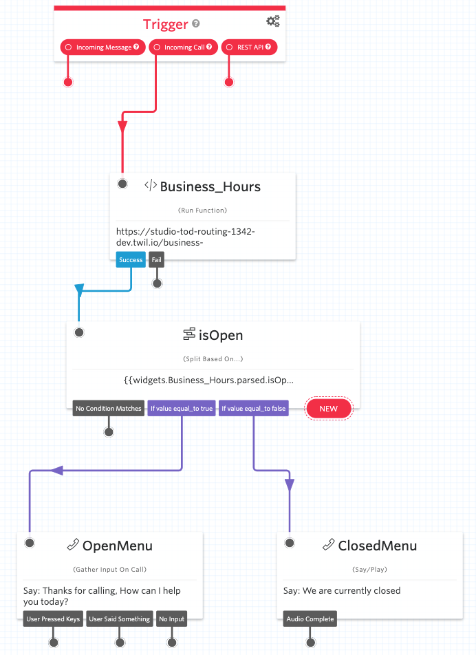

# Time of Day Routing

This function provides provides time of day routing with timezone and holiday support.



## How to use the template

The best way to use the Function templates is through the Twilio CLI as described below. If you'd like to use the template without the Twilio CLI, [check out our usage docs](../docs/USING_FUNCTIONS.md).

## Create a new project with this template

1. Install the [Twilio CLI](https://www.twilio.com/docs/twilio-cli/quickstart#install-twilio-cli)
2. Install the [Twilio Serverless Toolkit](https://www.twilio.com/docs/labs/serverless-toolkit/getting-started)

```shell
twilio plugins:install @twilio-labs/plugin-serverless
```

3. Initiate a new project

```
twilio serverless:init studio-tod-routing --template=studio-tod-routing && cd studio-tod-routing
```

4. Install the dependencies for local testing

```shell
npm install
```

## Testing locally

### Environment variables

This project requires some environment variables to be set. To keep your tokens and secrets secure, make sure to not commit the `.env` file in git. When setting up the project with `twilio serverless:init ...` the Twilio CLI will create a `.gitignore` file that excludes `.env` from the version history.

In your `.env` file, set the following values:

| Variable      | Meaning                                               | Required |
| :------------ | :---------------------------------------------------- | :------- |
| `ACCOUNT_SID` | Find in the [console](https://www.twilio.com/console) | Yes      |
| `AUTH_TOKEN`  | Find in the [console](https://www.twilio.com/console) | Yes      |

## Deploying

To run your function on Twilio, you need to:

- Enable `ACCOUNT_SID` and `AUTH_TOKEN` in your [functions configuration](https://www.twilio.com/console/functions/configure).

Deploy your function with the [Twilio CLI](https://www.twilio.com/docs/twilio-cli/quickstart). Note: you must run this from inside your project folder.

```
twilio serverless:deploy
```

## Function parameters

| Variable         | Meaning                                                                                   | Required | Default           |
| :--------------- | :---------------------------------------------------------------------------------------- | :------- | :---------------- |
| `openClosedTime` | Comma separated string representing open/closed hours and minutes. Example: "08:00,17:00" | No       | "00:00,23:59"     |
| `timezone`       | Timezone to be used                                                                       | No       | "America/Chicago" |

### Function Output

The function will return the following JSON object

```JSON
{
  "isOpen": true,
  "holiday": false,
  "open": "8:00 AM",
  "closed": "5:00 PM",
}
```
